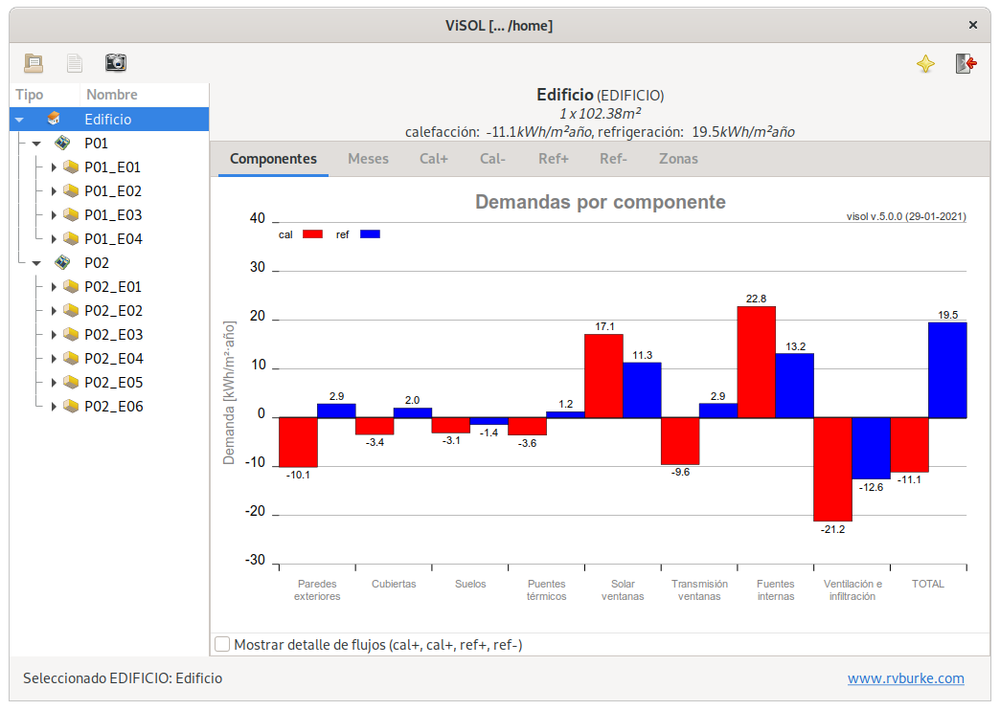
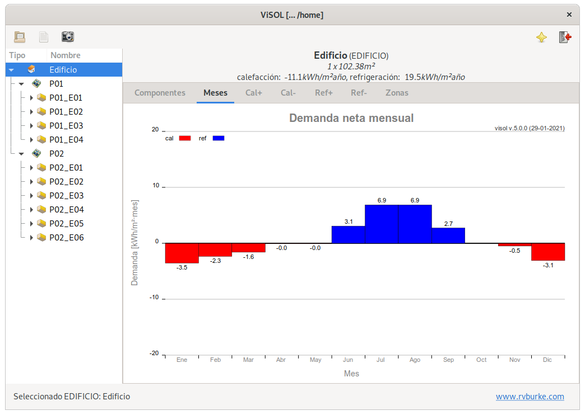
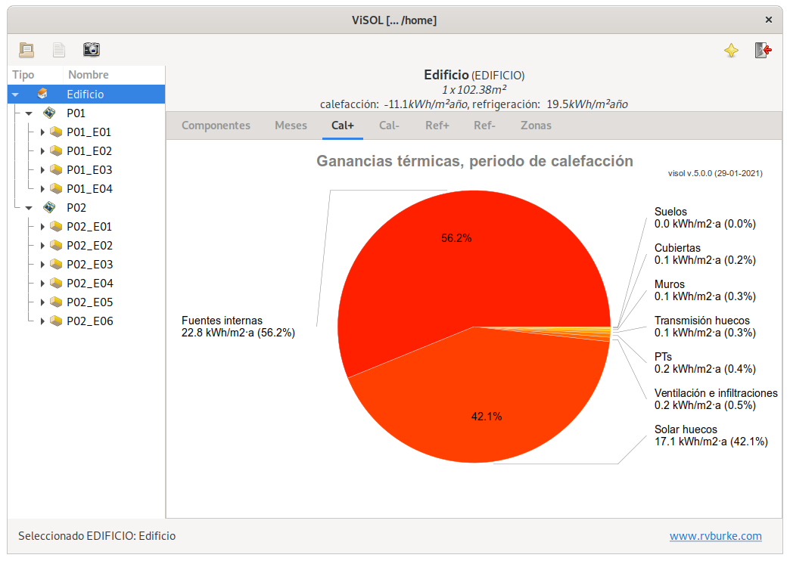
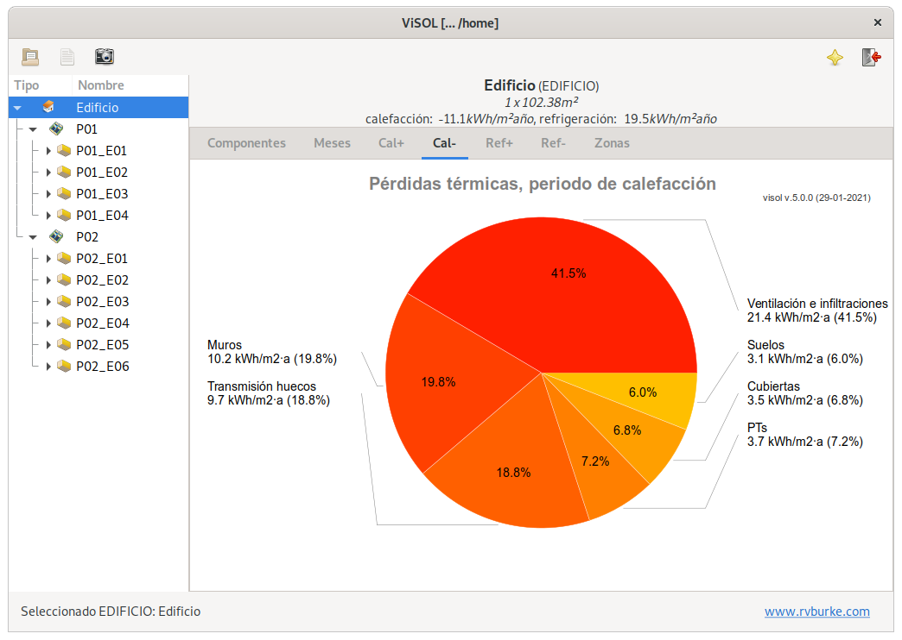
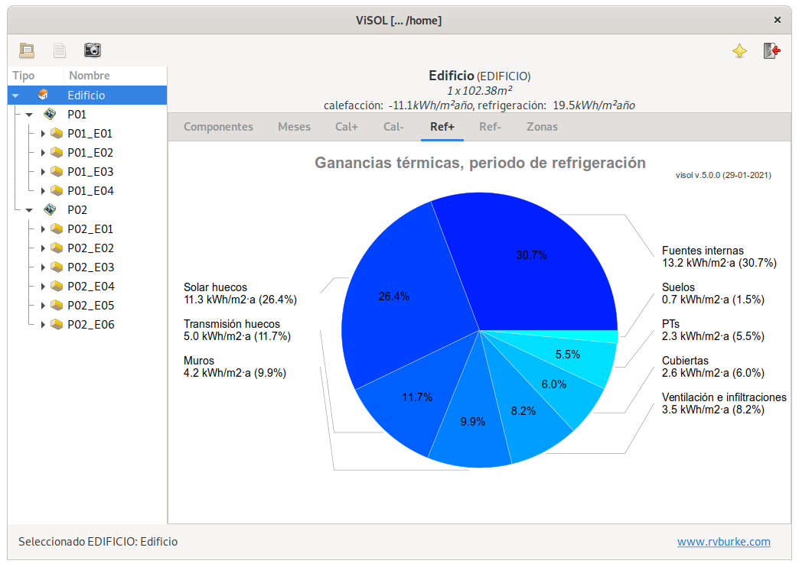
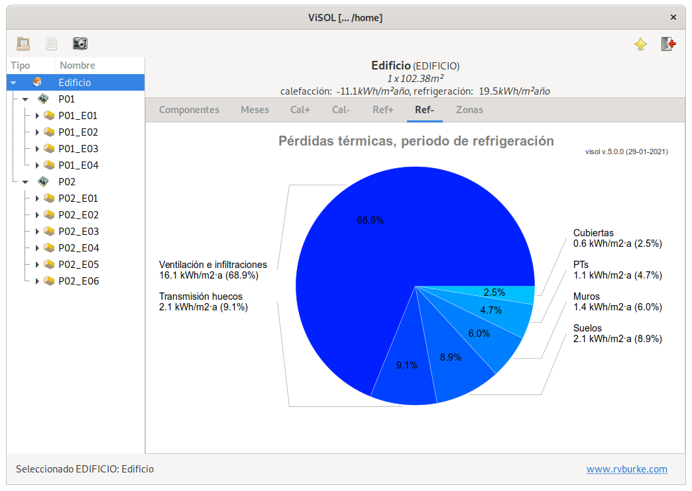
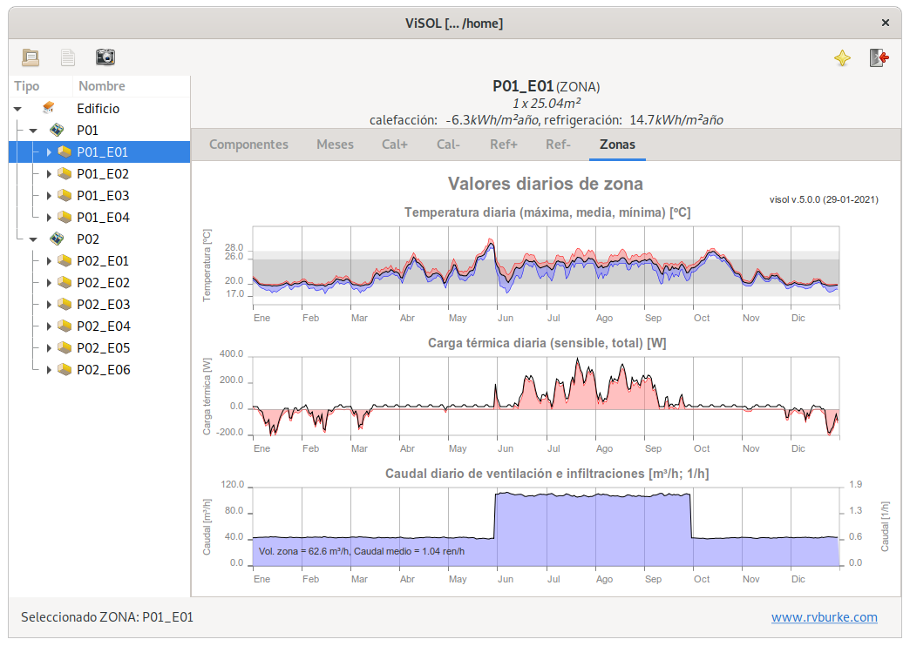
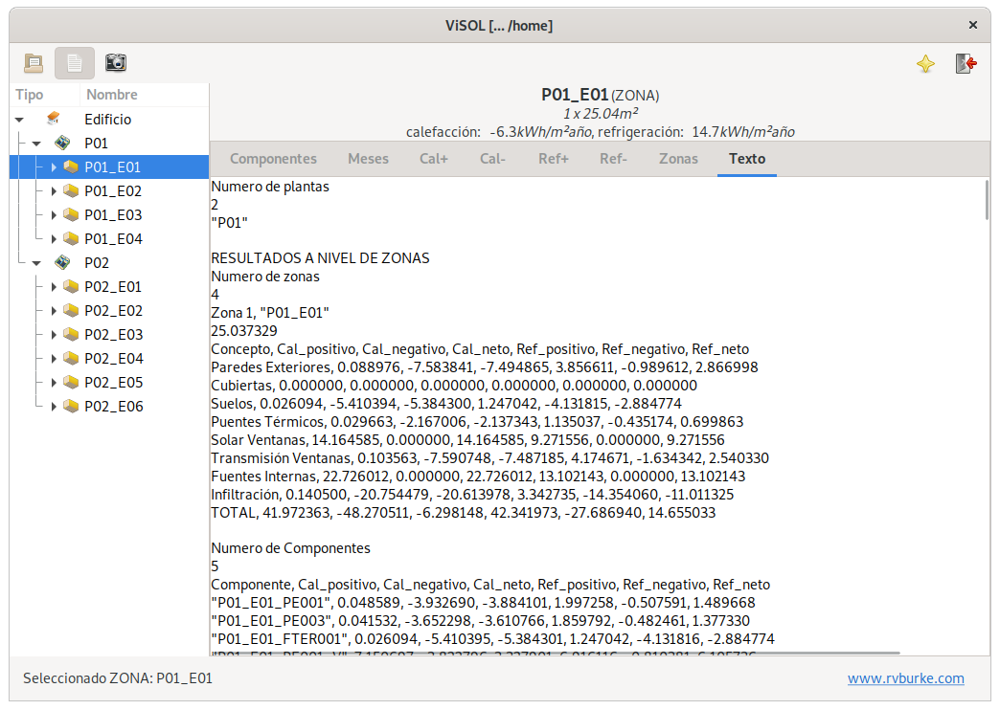
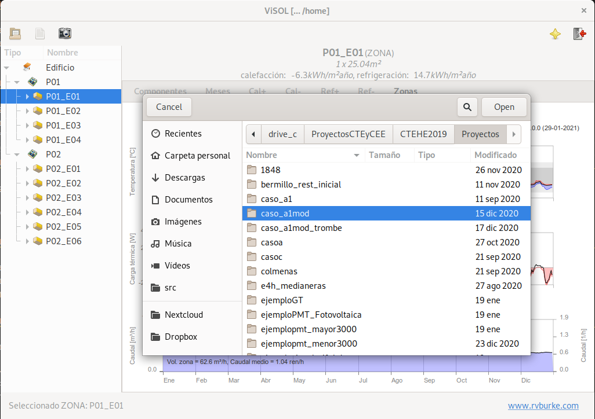

# ViSol - Visor de achivos de resultados de LIDER

## Descripción

**ViSol** es un **visor de los archivos de resultados generados por las
herramientas LIDER, CALENER y Herramienta Unificadada LIDER-CALENER**,
de verificación del DB-HE del CTE.

Una vez instalado, para su uso simplemente se requiere abrir un archivo
de resultados, de extensión .res o .re2.

Los resultados se pueden explorar a nivel de edificio, espacios o
componentes y se aporta información en forma de ratios por m² de
superficie acondicionada del edificio para cada uno de ellos
(generalmente kWh/m²·año).

El programa permite visualizar de forma rápida el comportamiento del
edificio en las temporadas de calefacción y refrigeración y detectar qué
componentes de la demanda o qué elementos son los responsables de las
ganancias (+) o pérdidas (-) de calor en el sistema.

Esto facilita el uso de los resultados obtenidos con las herramientas de
cálculo para mejorar el diseño del edificio.

## Instalación y código fuente

La herramienta funciona en sistemas GNU/Linux y MS-Windows.

El instalador para su uso en la plataforma Windows está disponible en la
[página de descargas](https://github.com/pachi/visol/releases) del
proyecto.

## Créditos y licencia

*ViSol* es un proyecto desarrollado por [Rafael Villar
Burke](http://www.rvburke.com/software.html) y *Daniel Jiménez González*
que se publica bajo una licencia libre, la licencia pública del proyecto
GNU (GPLv2 o posterior), utilizada en programas como el sistema
GNU/Linux y similar a las licencias empleadas en los proyecto Firefox o
LibreOffice.

Se puede consultar la licencia completa en el archivo COPYING.txt
distribuido con el código fuente, o su versión original inglesa en la
página del proyecto GNU, donde se proporciona también una versión no
oficial en castellano.

*ViSol* se distribuye con la esperanza de que resulte útil, pero SIN
NINGUNA GARANTÍA, ni garantía MERCANTIL implícita ni la CONVENIENCIA
PARA UN PROPÓSITO PARTICULAR.

> **note**
>
> Si utilizas la aplicación en publicaciones o artículos científicos
> agradecería que hicieses una cita de este tipo:
>
> > -   VILLAR BURKE, RAFAEL; JIMÉNEZ GONZÁLEZ, DANIEL, "Visol: Visor de
> >     archivos de resultados de LIDER", 2014. Disponible en:
> >     <http://www.rvburke.com/visorlider.html>

## Descripción de la interfaz y capturas de pantalla

-   La pantalla inicial de ViSol, con resultados a nivel de edificio,
    con la pestaña Componentes activa, muestra las **componentes de la
    demanda** para el elemento seleccionado:

-   La pestaña Meses muestra los **valores netos de la demanda neta
    mensual del elemento seleccionado** a lo largo de los meses del año,
    mostrando la duración del periodo de calefacción y refrigeración:

-   La pestaña cal+ muestra la composición de la demanda que supone
    **ganancia de calor en el edificio (+) durante la temporada de
    calefacción**:

-   La pestaña cal- muestra la composición de la demanda que supone
    **pérdida de calor en el edificio (-) durante la temporada de
    calefacción**:

-   La pestaña ref+ muestra la composición de la demanda que supone
    **ganancia de calor en el edificio (+) durante la temporada de
    refrigeración**:

-   La pestaña ref- muestra la composición de la demanda que supone
    **pérdida de calor en el edificio (-) durante la temporada de
    refrigeración**.

-   La pestaña Zonas muestra **valores diarios de algunos parámetros de
    la zona**, como la temperatura media, máxima y mínima, la carga
    total, sensible y latente, y el caudal de ventilación e
    infiltraciones (media diaria y promedio anual).

-   La interfaz permite **visualizar en una pestaña adicional el
    contenido del archivo de resultados** .res o .re2 activo:

-   Para **seleccionar un archivo de resultados** .res o .re2 basta con
    seleccionar el icono de selección de archivos que permite navegar el
    sistema de archivos, mostrando únicamente los archivos con dichas
    extensiones.

-   En cualquiera de las pantallas con gráficas de resultados se puede
    obtener una **captura de pantalla** usando el icono de la barra de
    herramientas que representa una cámara. De forma predeterminada las
    capturas de pantalla se almacenan en el directorio del archivo de
    resultados activo y el nombre contiene información de la fecha y
    hora de la captura, además del nombre del archivo de resultados
    empleado.
